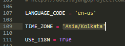

# my_site
My first blog site 
# django_project
<h3>Pre-requisites</h3>
<pre>Python (basics)</pre>

<h3>Step 1:- Installation of Pip(if not installed)</h3>

To install the pip make sure python is installed in system if not then first setup the python from https://www.python.org/downloads/

<!---->
<pre>

1. To download get-pip.py Run this command 
      <b>curl https://bootstrap.pypa.io/get-pip.py -o get-pip.py</b> 
2. After downloading run this command 
      <b>python get-pip.py</b> 
3. <b>:)</b> be happy you pip is installed.

</pre>
<h3>Step 2:- Installation of Django</h3>
To install the Django you just need to run this command,
<pre> <b>pip install Django</b></pre>
<h3>Step 3:- Start a project</h3>
You have to decide the path of your project to start the project, I like want to make it ease for myself so I prefered here to make it on desktop 
<pre>   </pre>

After it when you look at your path the you find a folder with projectname as you specified but in  
<b>my case folder is on desktop with name "itsalok"</b>
 
<pre>

</pre>

When go inside that folder you will find as, there is a folder(name same as the parent folder) and a file name as <b>manage(it helps to run the server for you</b>
 
<pre>

</pre>

When you move into the folder inside folder you will find the 4 files named as  
 <b>__init__ ,settings, urls, wsgi</b>
 
<pre>

</pre>

<h3>Step 4:- Start the server</h3>

To start the server you have to run that command

<pre>

</pre>
 
After executing that command you have to your browser and search for <b>http://127.0.0.1:8000/</b> then you will get as below

<pre>

</pre>
<h3>Step 5:- Creating the blog application</h3>
To create the application you have run the command written below:
 <pre>

</pre>
Now my updated project directory is seems like:
 <pre>

</pre>
<h3>Step 6:- Register the blog app</h3>

Now you have to open the <b>settings.py</b> file which is located at in your case <pre><b>---\---\----\projectname\projectname</b></pre> and in my case it is

<pre><b>C:\Users\HP\Desktop\itsalok\itsalok</b></pre>

and you have find the <b>INSTALLED_APPS</b> block of code

<pre>

</pre>

and add <b>'blog',</b> (as highlighted below in image) as given below and you will add same as you named your app during <b>Step 5</b>

 <pre>

</pre>
<h3>Step 7:- Specify the database</h3>

Now in the same file you have to find the block named as <b>DATABASES</b> and  
      <b>add the command given below</b> or highlighted in the image:-

<pre><b>'NAME': os.path.join(BASE_DIR, 'db.sqlite3'),</b></pre>
<pre></pre>
<h3>Step 8:Change the time zone</h3>

If you are from India then you have to change the time to <b>'Asia/Kolkata'</b> and it is done in same setting.py file you can see below,

<pre>

</pre>
<h2>Ready to make models</h2>

To make models we need some basics related to models, relationships among objects, Foreign keys and some other concepts.

<pre>Foreign key:- When an attribute of one table refer to the primary key of another table, then that attribute
is said as Foreign key.

Relationship:- When the tables are connected to each other.

1 to 1 relationship:- When one row in a table may be linked with only one row in another table and vice versa.

1 to m relationship:- When one row in the table may linked with many rows in another table.

m to 1 relationship:- When many rows from a table is linked with single row of another table. 

m to m relationship:- When many rows from a table are linked with many rows of another table.

Total participation:- It specifies that each entity in the entity set must compulsorily participate 
in at least one relationship instance in that relationship set.

Partial participation:- It specifies that each entity in the entity set may or may not participate in 
the relationship instance in that relationship set.
</pre>

And most important we have know about notations:-

There is a description video link below of UML class diagrams please check it first before going into deep
of creating code for your own specific model 
https://www.youtube.com/watch?v=UI6lqHOVHic

# I have to add model here 

As we make the model according to it we have to code into models.py

<pre>

</pre>
# Create tables for models in your database
 To create the tables for the models you have to goto your command line as run the given command(highlighted one) below:-

Now Django created the migration file you to apply to your database for this type and run the highlighted command below:-

# Django Admin

To add, edit and delete the posts we've just modeled, we will use Django admin. 
Let's open the blog/admin.py file in the code editor and replace its contents with this:

<pre>.
</pre>

As you can see, we import (include) the Post model defined in the previous chapter. To make our 
model visible on the admin page, we need to register the model with admin.site.register(Post).
OK, time to look at our Post model. Remember to run python manage.py runserver in the console to run
the web server. Go to your browser and type the address http://127.0.0.1:8000/admin/. You will see a login page like this:

<pre>
</pre>

To Log in into it we have to create the <b>Superuser- a user who have control over everything on the site.</b> Go back to command line and type the following command

<pre>python manage.py createsuperuser</pre>
<pre></pre>

Return to your browser. Log in with the superuser's credentials you chose; you should see the Django admin dashboard.

<pre></pre>
